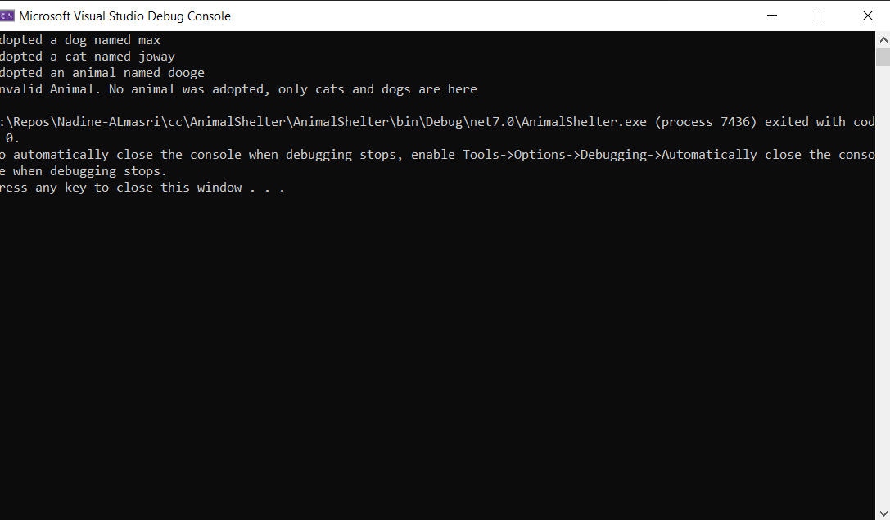
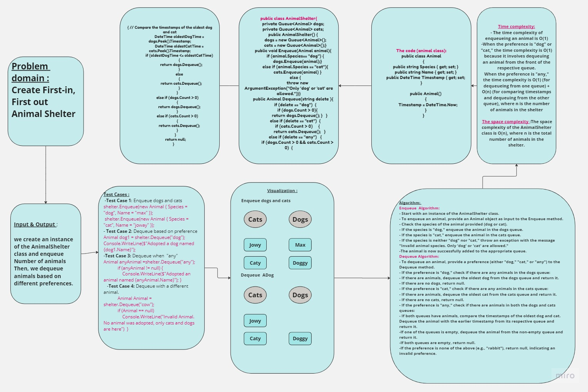
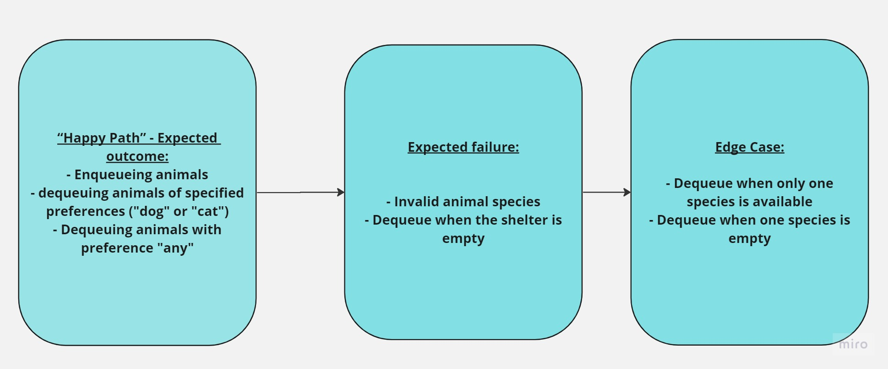

## Summary:
------------
The AnimalShelter class is designed to hold dogs and cats using a first-in, 
first-out (FIFO) approach. It provides methods to enqueue animals (dogs and cats)
and dequeue animals based on type. If the type is "any," 
the class returns the oldest animal in the shelter (based on their enqueue time).
## Description:

The AnimalShelter class is implemented in C#. It contains two private queues, one for dogs and another for cats, to store the animals waiting in the shelter. The class provides an Enqueue method to add animals to the shelter and a Dequeue method to retrieve animals based on the user's preference.
## Approach & Efficiency:
- Enqueue: When an animal is enqueued, the method checks its species (dog or cat) and adds it to the respective queue. The time complexity of enqueueing an animal is O(1).

- Dequeue: When an animal is dequeued, the method checks the user's preference. If the preference is "dog" or "cat," the oldest animal of the specified species is dequeued from the respective queue. If the preference is "any," the method compares the timestamps of the oldest dog and cat and dequeues the one with the earlier timestamp. The time complexity of dequeuing an animal is O(1) for preference "dog" or "cat" and O(1) + O(n) for preference "any," where n is the number of animals in the shelter.
## Solution And Visual :
You can use this implementation to create an instance of the AnimalShelter class, enqueue animals, and dequeue animals based on different preferences.   
  
    public static void Main(string[] args)
        {
            AnimalShelter shelter = new AnimalShelter();

            // Enqueue some animals
            shelter.Enqueue(new Animal { Species = "dog", Name = "max" });
            shelter.Enqueue(new Animal { Species = "cat", Name = "joway" });
            shelter.Enqueue(new Animal { Species = "dog", Name = "dooge" });
            shelter.Enqueue(new Animal { Species = "cat", Name = "caty" });

            
            Animal dog = shelter.Dequeue("dog");
            if (dog != null)
            {
                Console.WriteLine($"Adopted a dog named {dog.Name}");
            }

            Animal cat = shelter.Dequeue("cat");
            if (cat != null)
            {
                Console.WriteLine($"Adopted a cat named {cat.Name}");
            }

            // Dequeue when  "any"
            Animal anyAnimal = shelter.Dequeue("any");
            if (anyAnimal != null)
            {
                Console.WriteLine($"Adopted an animal named {anyAnimal.Name}");
            }

            // Dequeue with a differnt animal
            Animal Animal = shelter.Dequeue("cow");
            if (Animal == null)
            {
                Console.WriteLine("Invalid Animal. No animal was adopted, only cats and dogs are here");
            }
        }
    }

**Output**

## WhiteBoard

