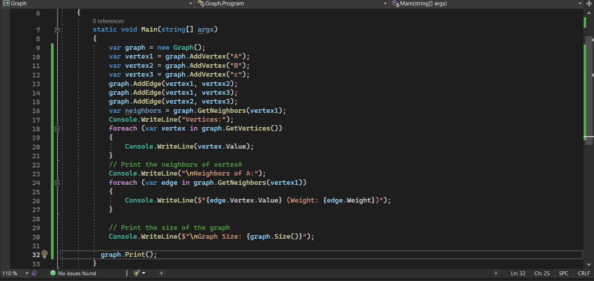
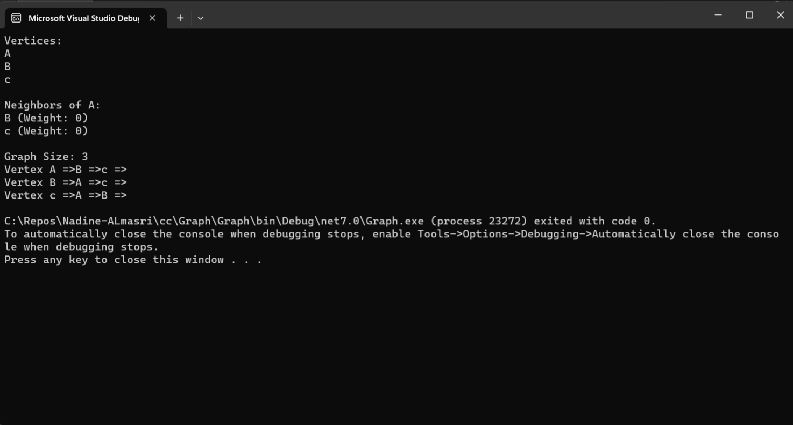
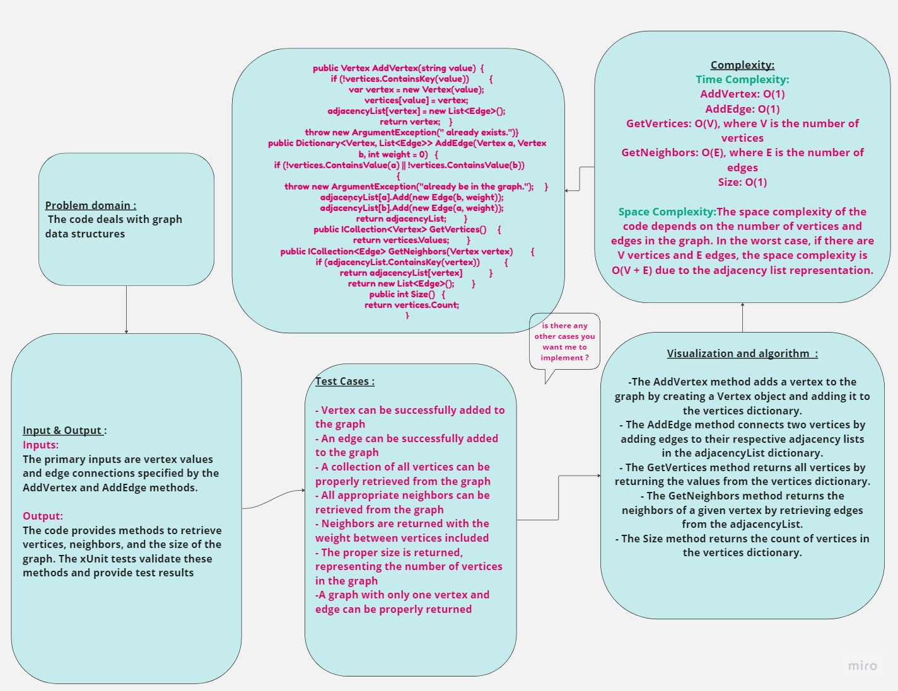

## Summary:
The provided code implements a graph data structure using an adjacency list representation. It defines a Graph class with methods for adding vertices, adding edges, retrieving vertices, retrieving neighbors, and getting the size of the graph. Additionally, it includes xUnit tests to verify the functionality of these methods.
## Description:
The code defines a Graph class that represents a graph with vertices and edges. The AddVertex method allows adding vertices to the graph, while the AddEdge method connects two existing vertices with an optional weight. The GetVertices method returns all vertices in the graph, and GetNeighbors returns neighbors of a specific vertex, including their weights. The Size method returns the total number of vertices in the graph.

The code also includes xUnit tests to ensure the correctness of the graph implementation by verifying various aspects of its functionality.
## Inputs and Outputs:

Inputs: The primary inputs are vertex values and edge connections specified by the AddVertex and AddEdge methods.
Outputs: The code provides methods to retrieve vertices, neighbors, and the size of the graph. The xUnit tests validate these methods and provide test results.
## Visual:
Here's a visual representation of the code:

## Approach & Efficiency:
- **Time Complexity:**
- The time complexity of the operations in the provided code can be summarized as follows:

- AddVertex: O(1)
- AddEdge: O(1)
- GetVertices: O(V), where V is the number of vertices
- GetNeighbors: O(E), where E is the number of edges
- Size: O(1)
- **Space Complexity:**

The space complexity of the code depends on the number of vertices and edges in the graph. In the worst case, if there are V vertices and E edges, the space complexity is O(V + E) due to the adjacency list representation.

