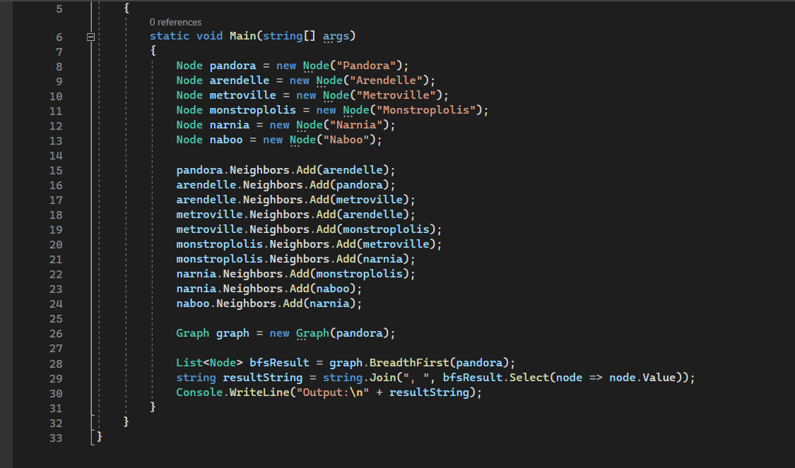
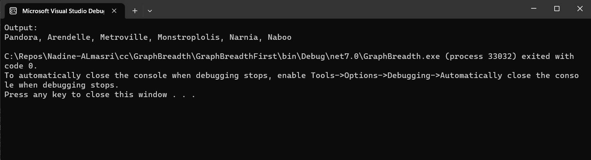
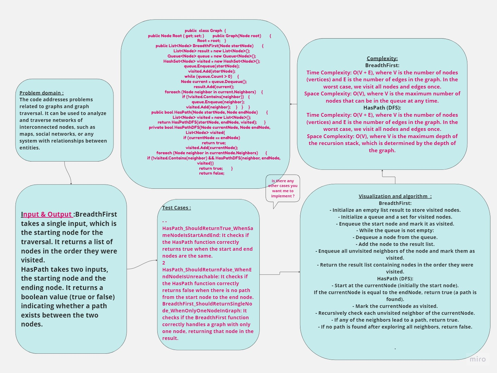

## Summary:
The provided C# code implements a simple graph data structure with two main functions: BreadthFirst and HasPath. The BreadthFirst function performs a breadth-first traversal of the graph and returns a list of nodes in the order they were visited. The HasPath function checks whether there is a path between two nodes in the graph.
## Description:
BreadthFirst: This function starts from a given node and explores the graph in a breadth-first manner using a queue. It returns a list of nodes in the order they were visited.

HasPath: This function uses depth-first search (DFS) to check whether a path exists between two nodes. It returns a boolean value indicating whether a path was found.
## Visual:
Here's a visual representation of the BinarySearch class:

## Approach & Efficiency:
### BreadthFirst:

- Time Complexity: O(V + E), where V is the number of nodes (vertices) and E is the number of edges in the graph. In the worst case, we visit all nodes and edges once.
- Space Complexity: O(V), where V is the maximum number of nodes that can be in the queue at any time.
### HasPath (DFS):

- Time Complexity: O(V + E), where V is the number of nodes (vertices) and E is the number of edges in the graph. In the worst case, we visit all nodes and edges once.
- Space Complexity: O(V), where V is the maximum depth of the recursion stack, which is determined by the depth of the graph.## WhiteBoard   

