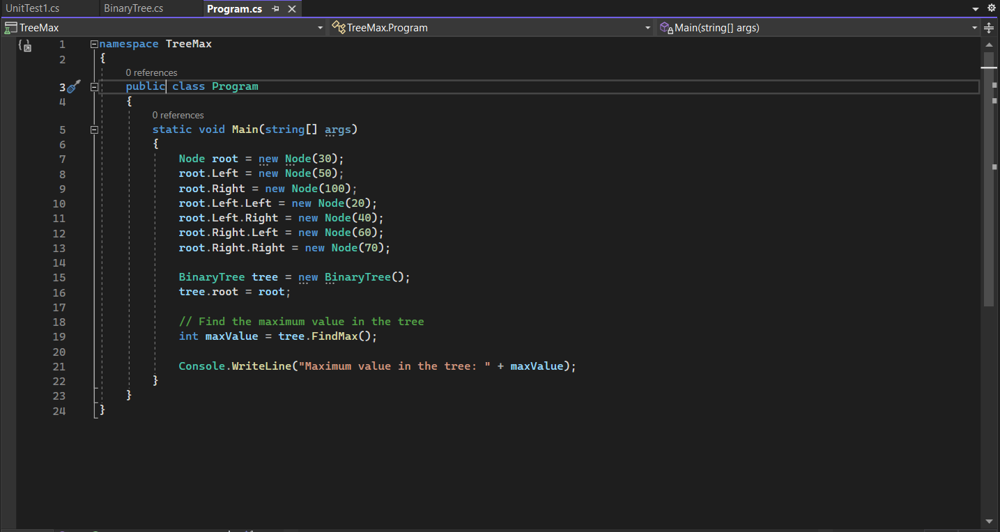
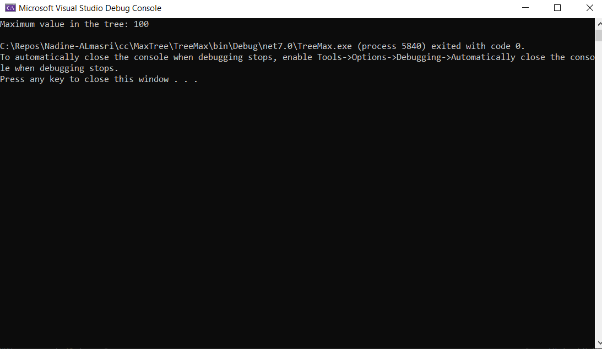
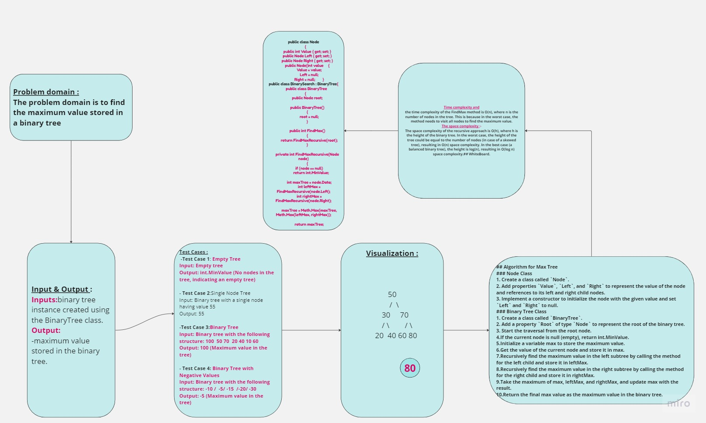

## Summary:
This code implements a binary tree data structure and a method named FindMax in the BinaryTree class. The FindMax method is used to find the maximum value stored in the binary tree. It works for both Binary Search Trees (BST) and regular binary trees with numeric values.
## Description:
The BinaryTree class contains a private nested class Node, representing a node in the binary tree. Each node has an integer Data and two child nodes Left and Right.

The FindMax method uses a recursive depth-first traversal (pre-order) to traverse the binary tree. It starts the traversal from the root of the tree and recursively visits each node while keeping track of the maximum value found so far.

The method FindMaxRecursive is a helper method that performs the recursive traversal. When a node is visited, the method compares the node's value with the maximum value found so far. It then recursively calls itself for the left and right child nodes, and updates the maximum value if a higher value is found in the subtree.
## Visual:
Here's a visual representation of the TreeMax :

## Approach & Efficiency:
 the time complexity of the FindMax method is O(n), where n is the number of nodes in the tree. This is because in the worst case, the method needs to visit all nodes to find the maximum value.

The space complexity of the recursive approach is O(h), where h is the height of the binary tree. In the worst case, the height of the tree could be equal to the number of nodes (in case of a skewed tree), resulting in O(n) space complexity. In the best case (a balanced binary tree), the height is log(n), resulting in O(log n) space complexity.## WhiteBoard   

