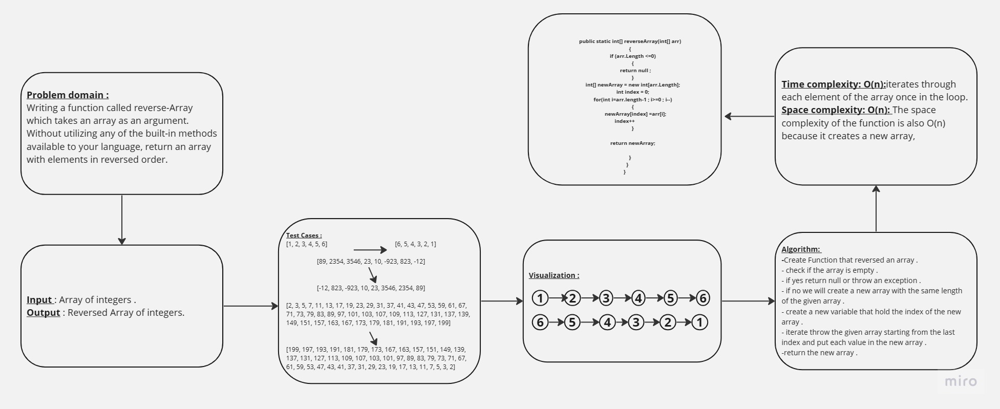
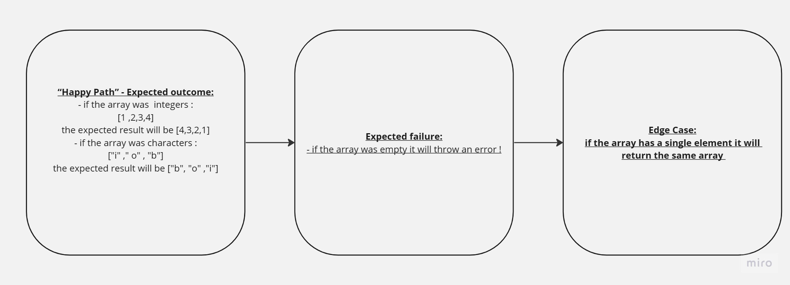

[Home](..\README.md)

## Summary
The reverse-Array function takes an array and returns a revered array .

## Description
That function iterate throw the given array starting from the last index and put each value in the new array .
 to return the new array .
## Solution :

