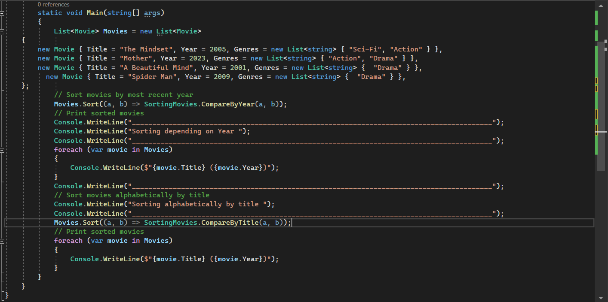
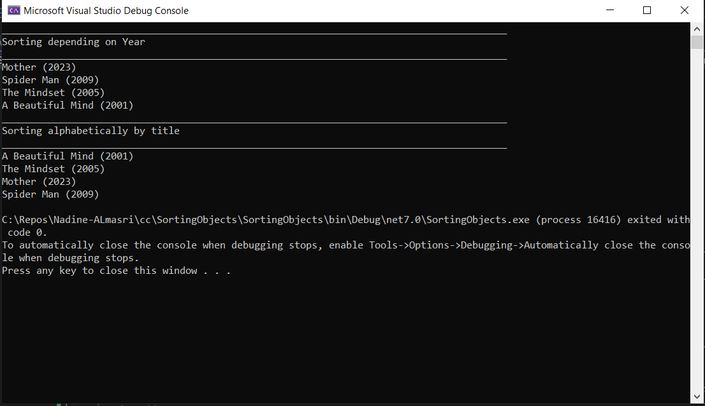
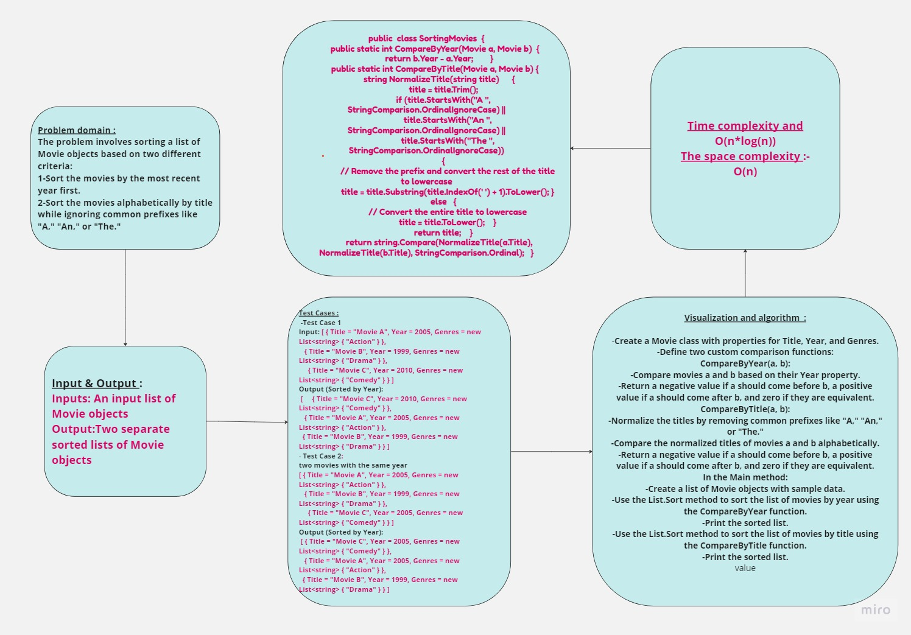

## Summary:
In this code challenge, we are tasked with sorting a list of Movie objects based on two different criteria. First, we need to sort them by the most recent year first, and second, we need to sort them alphabetically by title while ignoring common prefixes like "A," "An," or "The." The challenge involves creating two custom comparison functions and applying them to sort the list of movies.
## Description:
The code challenge focuses on sorting a list of Movie objects in C#. It provides a Movie class with properties like Title (string), Year (number), and Genres (a list of strings). The goal is to sort this list based on two criteria: by the most recent year and alphabetically by title while ignoring specific prefixes.
## Visual:

Here's a visual representation of the Insertion Sort class:

## Approach & Efficiency:
- The time complexity of sorting a list of n movies using this approach is typically O(n*log(n)), which is the efficiency of the sorting algorithm used by List.Sort. The additional string comparisons in CompareByTitle also contribute to the overall time complexity.
- space complexity is the input data. Therefore, the space complexity of the code is O(n), where n is the number of movies in the input list. Other factors contribute only constant space overhead
## WhiteBoard 

