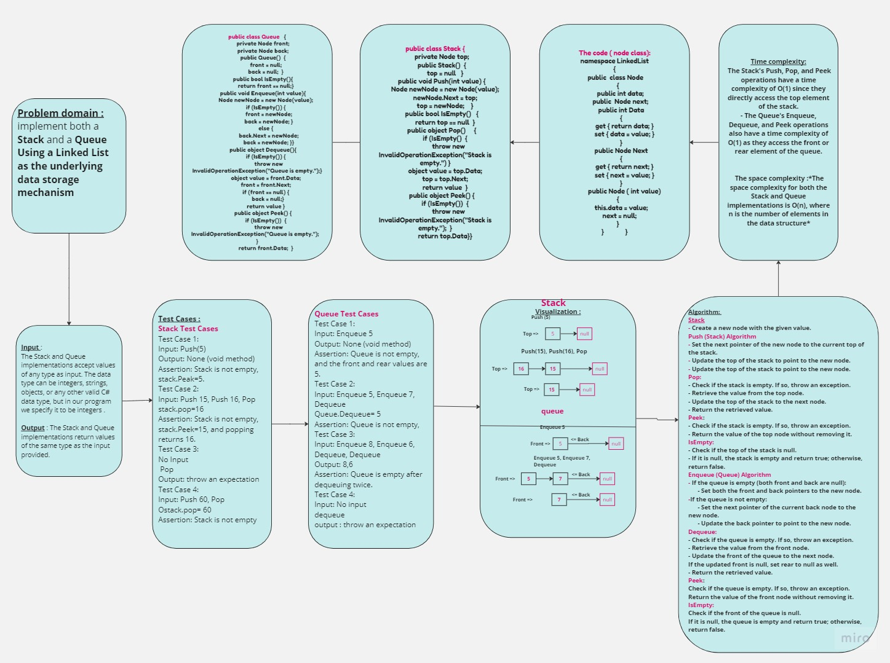
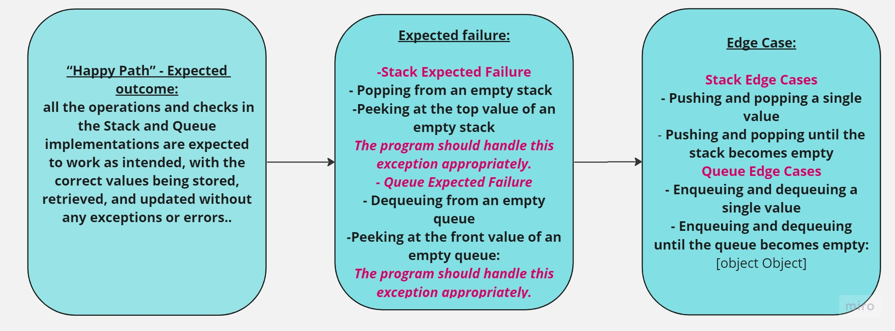

## Summary:
This project provides an implementation of the Stack and Queue data structures using a Linked List as the underlying data storage mechanism. The Stack follows the Last-In-First-Out (LIFO) principle, while the Queue follows the First-In-First-Out (FIFO) principle. The implementation includes methods for pushing, popping, peeking, and checking the emptiness of the stack, as well as enqueueing, dequeuing, peeking, and checking the emptiness of the queue.
## Description:
The Stack and Queue are essential data structures used in computer science and software development. The Stack allows operations on elements only at the top, whereas the Queue allows operations on elements at both the front and back ends.

This implementation uses a Linked List to store the data elements. Each node in the Linked List holds a value and a reference to the next node, forming a chain-like structure. The top pointer in the Stack points to the topmost node, while the front and back pointers in the Queue indicate the front and back nodes, respectively.

- The Stack class provides methods for pushing values onto the stack, popping values from the stack, peeking at the top value, and checking if the stack is empty.

- The Queue class provides methods for enqueueing values into the queue, dequeuing values from the queue, peeking at the front value, and checking if the queue is empty.

## Usage: 

To use the Stack and Queue implementation in your C# project, follow these steps:

- Include the Node, Stack, and Queue classes in your project.
- Create instances of the Stack and Queue classes.
- Use the provided methods to perform stack and queue operations such as pushing, popping, peeking, enqueueing, dequeuing, and checking emptiness.
Here's an example of how to use the Stack :
            
         // Create a stack
        Stack stack = new Stack();

       // Push values onto the stack
      stack.Push(1);
      stack.Push(2);

      // Pop values from the stack
       int value = stack.Pop();

## Approach & Efficiency:

- The Stack's Push, Pop, and Peek operations have a time complexity of O(1) since they directly access the top element of the stack.
- The Queue's Enqueue, Dequeue, and Peek operations also have a time complexity of O(1) as they access the front or rear element of the queue.

*The space complexity for both the Stack and Queue implementations is O(n), where n is the number of elements in the data structure*
## Solution:
The solution provides an implementation of the Stack and Queue data structures using a Linked List. The Stack class represents a Last-In-First-Out (LIFO) data structure, while the Queue class represents a First-In-First-Out (FIFO) data structure.

The Stack class has the following methods:

- Push(value): Adds a new element with the given value to the top of the stack.
- Pop(): Removes and returns the top element from the stack.
- Peek(): Returns the value of the top element without removing it.
- IsEmpty(): Checks if the stack is empty.
The Queue class has the following methods:

- Enqueue(value): Adds a new element with the given value to the rear of the queue.
- Dequeue(): Removes and returns the front element from the queue.
- Peek(): Returns the value of the front element without removing it.
- IsEmpty(): Checks if the queue is empty.

## WhiteBoard :
_______________________________________

