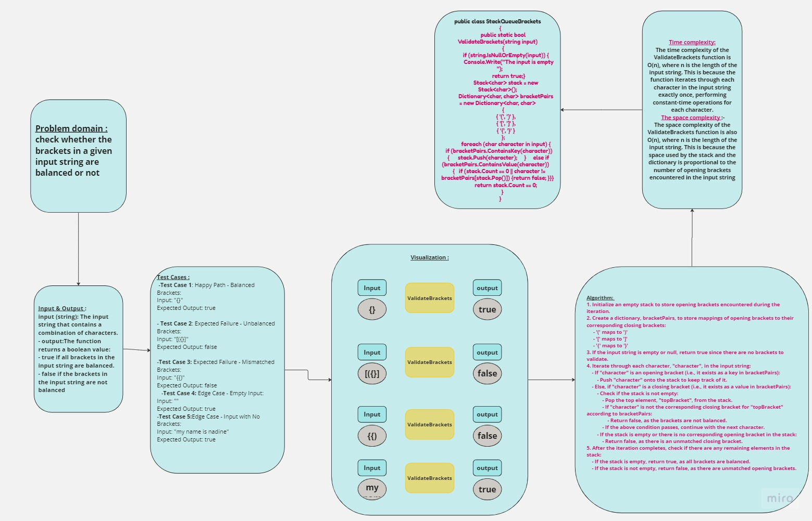

## Summary:

The provided C# code contains a function named ValidateBrackets, which checks if the brackets in a given input string are balanced (i.e., every opening bracket has a corresponding closing bracket). The function supports three types of brackets: round brackets "()", square brackets "[]", and curly brackets "{}". It returns a boolean value indicating whether the brackets are balanced or not.
## Description:
The ValidateBrackets function uses a stack data structure to keep track of the opening brackets encountered while iterating through the input string. For each character in the input, it checks if the character is an opening bracket. If it is, the character is pushed onto the stack. If the character is a closing bracket, the function checks if there is a corresponding opening bracket on the top of the stack. If there is a match, the opening bracket is popped from the stack, indicating that the pair is balanced. If there is no match or the stack is empty, it means there is an unmatched closing bracket, and the function returns false.

After the loop completes, the function checks if there are any remaining elements in the stack. If the stack is empty, all brackets were matched, and the function returns true. Otherwise, if there are unmatched opening brackets in the stack, it returns false.
## Approach & Efficiency:
The approach used in the PseudoQueue code is to simulate a queue using two stacks. The enqueue operation involves transferring elements between the two stacks to maintain the first-in, first-out (FIFO) order. The dequeue operation simply pops the top element from stack1, which corresponds to the oldest value in the queue.
- Time Complexity:
The time complexity of the ValidateBrackets function is O(n), where n is the length of the input string. This is because the function iterates through each character in the input string exactly once, performing constant-time operations for each character.
- Space Complexity:
The space complexity of the ValidateBrackets function is also O(n), where n is the length of the input string. This is because the space used by the stack and the dictionary is proportional to the number of opening brackets encountered in the input string.

## Using And Visual:
To use the ValidateBrackets function, you need to follow these steps:

Copy the C# code that includes the StackQueueBrackets class and the ValidateBrackets method into your C# project or file.

Ensure that you have the required using directives at the beginning of your file:

	using System;
	using System.Collections.Generic;

Now you can call the ValidateBrackets method in your code to check if the brackets in a given string are balanced. Here's an example of how to use it:

    namespace stack_queue_brackets
    {
        internal class Program
        {
            static void Main(string[] args)
            {
               Console.WriteLine( StackQueueBrackets.ValidateBrackets(""));
                Console.WriteLine(StackQueueBrackets.ValidateBrackets("}{"));
                Console.WriteLine(StackQueueBrackets.ValidateBrackets("(){}()[]"));

            }
        }
    }
*The Console Output*

## WhiteBoard   

