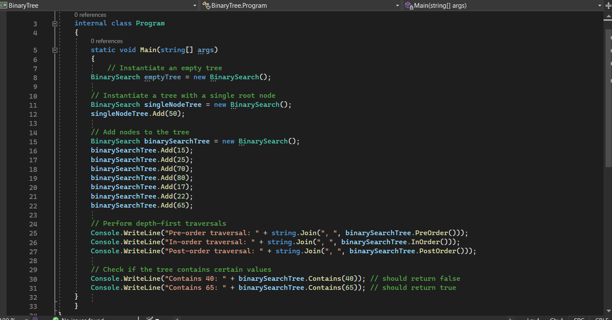
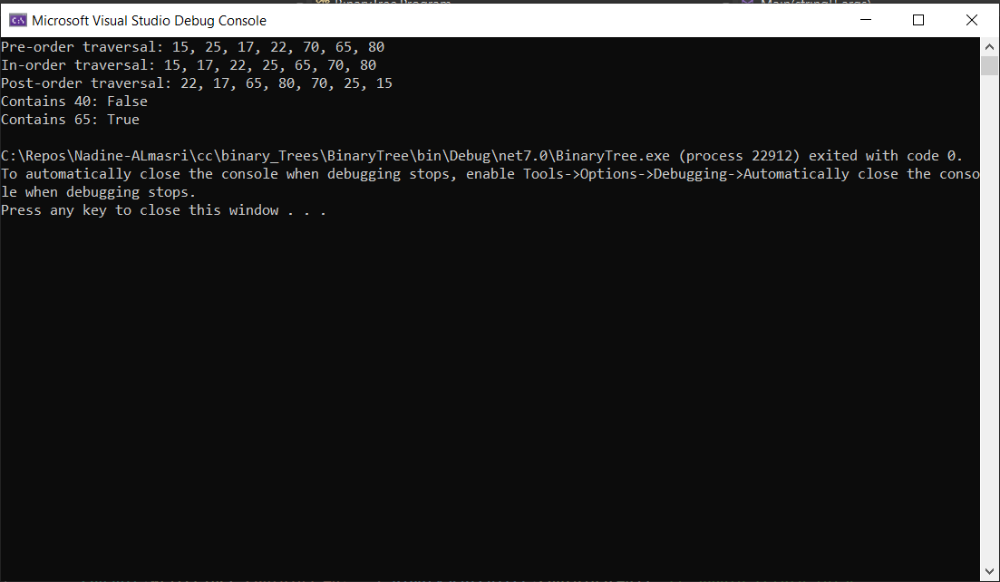
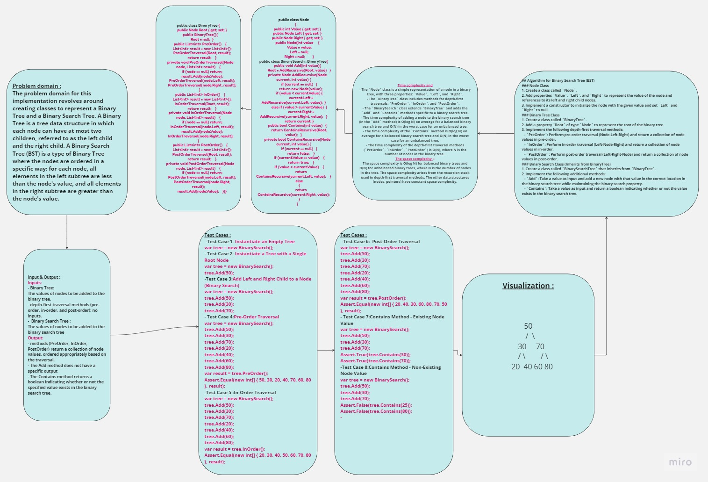

## Summary:
In this implementation, we have created three classes: Node, BinaryTree, and BinarySearch. The Node class represents a single node in a binary tree, with properties for the node's value, left child node, and right child node. The BinaryTree class is responsible for implementing depth-first traversals such as pre-order, in-order, and post-order. The BinarySearchTree class extends BinaryTree and adds functionality specific to a binary search tree, such as adding nodes in the correct location and checking for the existence of a value in the tree.

## Description:
The Node class is a simple representation of a node in a binary tree, with three properties: Value, Left, and Right, representing the node's value and references to its left and right child nodes, respectively.

The BinaryTree class includes methods for depth-first traversals. These methods are PreOrder, InOrder, and PostOrder. Each method recursively traverses the binary tree and returns a collection of node values in the desired order.

The BinarySearch class is a sub-class of BinaryTree and inherits the depth-first traversal methods. It includes additional methods like Add to insert a new node with the given value into the binary search tree, maintaining its binary search property. The class also has a Contains method to check if a given value exists in the tree.

## Visual:
Here's a visual representation of the BinarySearch class:

## Approach & Efficiency:
- The PreOrder, InOrder, and PostOrder methods in the BinaryTree class perform depth-first traversals. They traverse the binary tree and collect node values in the specified order. The time complexity of each traversal method is O(N), where N is the number of nodes in the binary tree.
- The Add method in the BinarySearch class inserts a new node into the binary search tree while maintaining its binary search property. It uses recursion to find the appropriate location to insert the node. The time complexity of adding a node is O(log N) on average for a balanced binary search tree and O(N) in the worst case for an unbalanced tree.
- The Contains method in the BinarySearchTree class checks whether a given value exists in the binary search tree. It also uses recursion to traverse the tree. The time complexity of the Contains method is O(log N) on average for a balanced binary search tree and O(N) in the worst case for an unbalanced tree.
## WhiteBoard   

