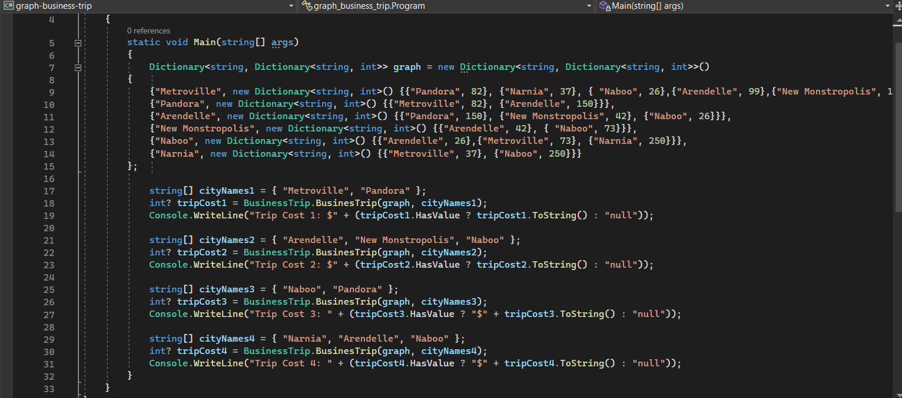
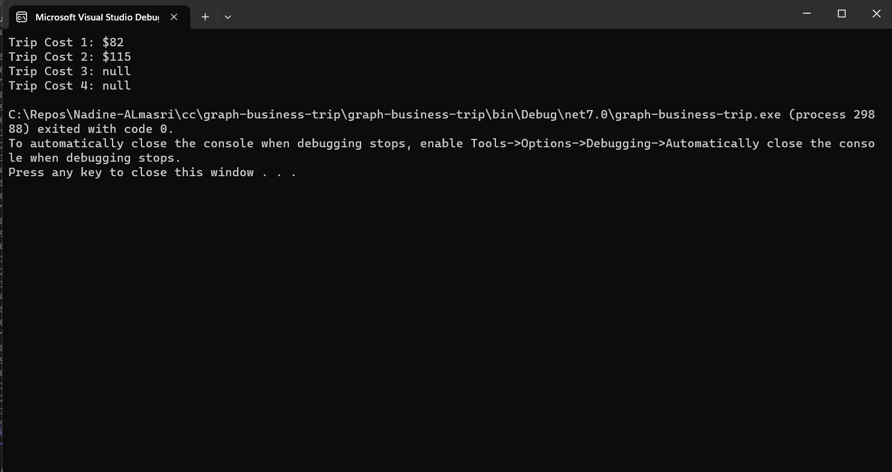
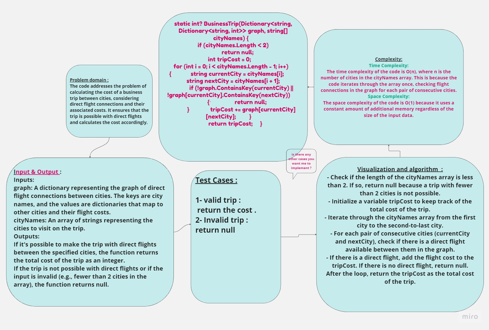

## Summary:
The provided C# code implements a function called BusinessTrip that calculates the cost of a business trip between cities using a graph representing direct flight connections. The function takes a graph (represented as a dictionary) and an array of city names as input. It returns the total cost of the trip if it's possible to travel directly between the cities, or null if the trip is not possible.
## Description:
The code initializes a dictionary called graph to represent a graph of direct flight connections between cities, where each city maps to other cities and their associated flight costs. It then defines the BusinessTrip function, which checks if it's possible to travel directly between the cities in the input array and calculates the total cost of the trip.
## Visual:
Here's a visual representation of the BinarySearch class:

## Approach & Efficiency:
- The time complexity of the code is O(n), where n is the number of cities in the cityNames array. This is because the code iterates through the array once, checking flight connections in the graph for each pair of consecutive cities.
- The space complexity of the code is O(1) because it uses a constant amount of additional memory regardless of the size of the input data.
## WhiteBoard   

