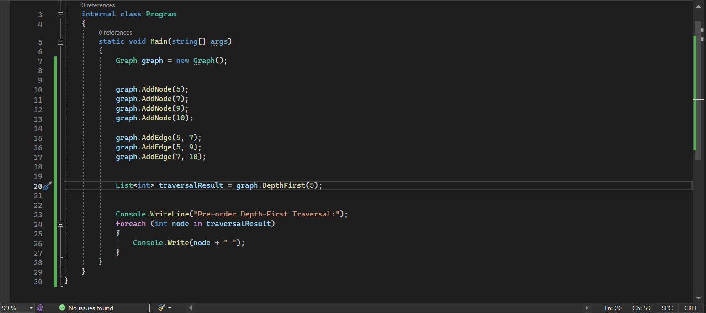

## Summary:
The code represents a simple graph data structure and a depth-first traversal algorithm for that graph. It includes methods for adding nodes and edges to the graph and a DepthFirst method that performs a pre-order depth-first traversal starting from a specified node. Xunit tests are provided to ensure the correctness of the DepthFirst method.
## Description:
The code defines a Graph class with methods for adding nodes and edges to the graph and a DepthFirst method for performing a depth-first traversal. The DepthFirst method takes a starting node as input and returns a list of nodes in their pre-order depth-first traversal order.
## Visual:
Here's a visual representation of the BinarySearch class:

## Approach & Efficiency:
###  Time Complexity:
The time complexity of the depth-first traversal algorithm is O(V + E), where V is the number of vertices (nodes) and E is the number of edges in the graph. In the worst case, the algorithm visits every vertex and edge once.
### Space Complexity: 
The space complexity is O(V) in the worst case, where V is the number of vertices. This space is used to store the result list and the set of visited nodes.

