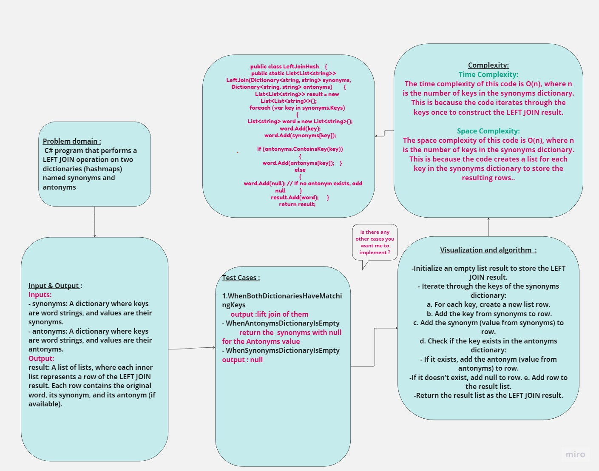

## Summary:
The code defines a C# program that performs a LEFT JOIN operation on two dictionaries (hashmaps) named synonyms and antonyms. It constructs a new data structure that contains the key from the synonyms dictionary, the corresponding value from the synonyms dictionary, and, if available, the corresponding value from the antonyms dictionary. The result is a list of lists representing the LEFT JOIN result.
## Description:
- The program starts with two example dictionaries: synonyms and antonyms, where the keys represent words, and the values represent their synonyms and antonyms, respectively.
- It defines a LeftJoin method to perform the LEFT JOIN operation.
- The code iterates through the keys of the synonyms dictionary.
- For each key, it creates a new row (a list of strings) containing the key from synonyms, its synonym, and, if found, its antonym from the antonyms dictionary.
If no antonym is found in the antonyms dictionary, it adds null to the row.
- The resulting rows are collected into a list, forming the LEFT JOIN result.
- Finally, the code prints the result to the console.
## Inputs and Outputs:

Input:
- synonyms: A dictionary where keys are word strings, and values are their synonyms.
- antonyms: A dictionary where keys are word strings, and values are their antonyms.
Output: result: A list of lists, where each inner list represents a row of the LEFT JOIN result. Each row contains the original word, its synonym, and its antonym (if available).
## Visual:
Here's a visual representation of the code:

## Approach & Efficiency:
- Time Complexity:

The time complexity of this code is O(n), where n is the number of keys in the synonyms dictionary. This is because the code iterates through the keys once to construct the LEFT JOIN result.
- Space Complexity:

The space complexity of this code is O(n), where n is the number of keys in the synonyms dictionary. This is because the code creates a list for each key in the synonyms dictionary to store the resulting rows.

