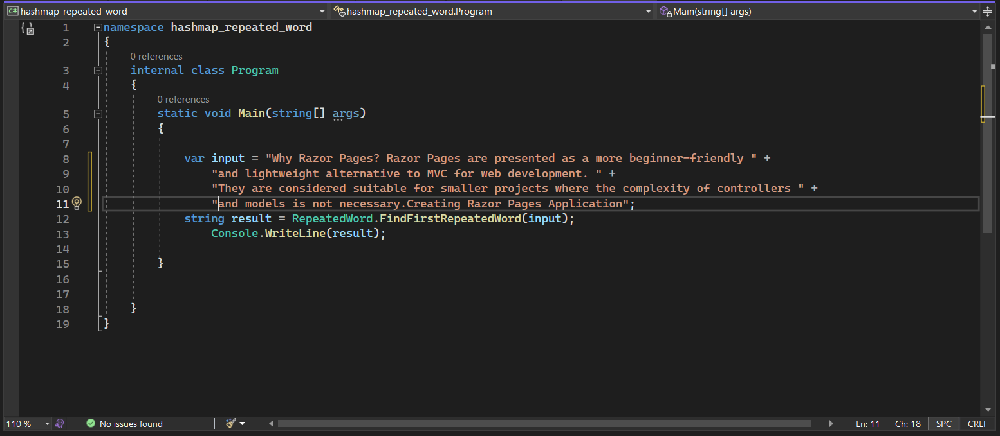
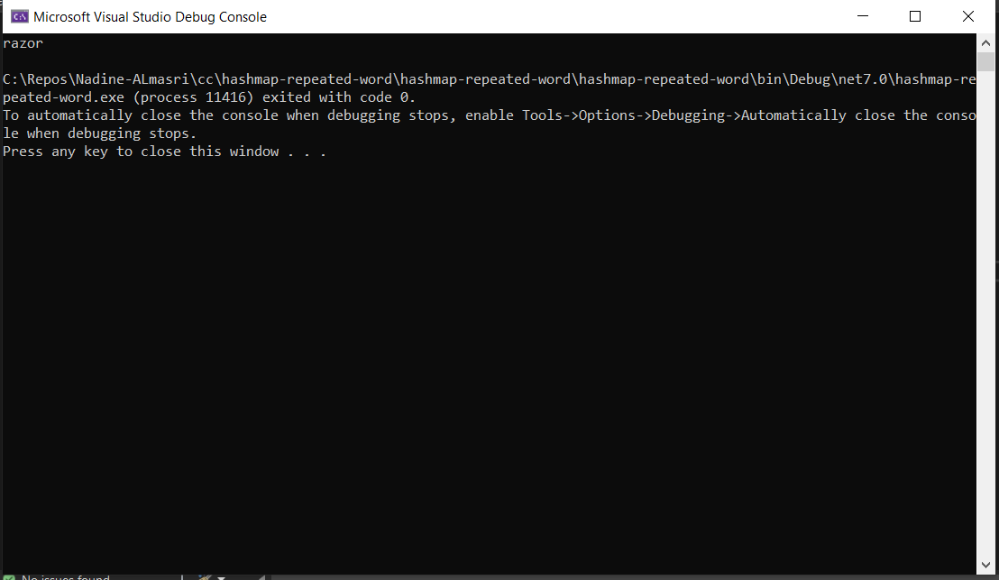
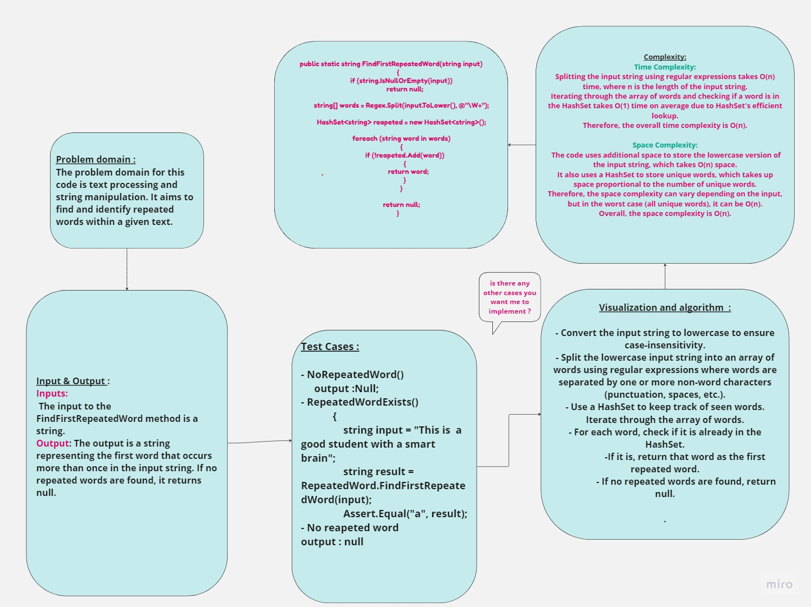

## Summary:
The provided code defines a C# class called RepeatedWordFinder that contains a method called FindFirstRepeatedWord. This method takes an input string and finds the first word to occur more than once in the string.

## Description:
The FindFirstRepeatedWord method uses regular expressions and a HashSet to split the input string into words, convert them to lowercase for case-insensitivity, and then identify the first repeated word in the string.

## Inputs and Outputs:

Input: The input to the FindFirstRepeatedWord method is a string.
Output: The output is a string representing the first word that occurs more than once in the input string. If no repeated words are found, it returns null.
## Visual:
Here's a visual representation of the code:

## Approach & Efficiency:
- Time Complexity:

Splitting the input string using regular expressions takes O(n) time, where n is the length of the input string.
Iterating through the array of words and checking if a word is in the HashSet takes O(1) time on average due to HashSet's efficient lookup.
Therefore, the overall time complexity is O(n).
- Space Complexity:

The code uses additional space to store the lowercase version of the input string, which takes O(n) space.
It also uses a HashSet to store unique words, which takes up space proportional to the number of unique words.
Therefore, the space complexity can vary depending on the input, but in the worst case (all unique words), it can be O(n).
Overall, the space complexity is O(n).

