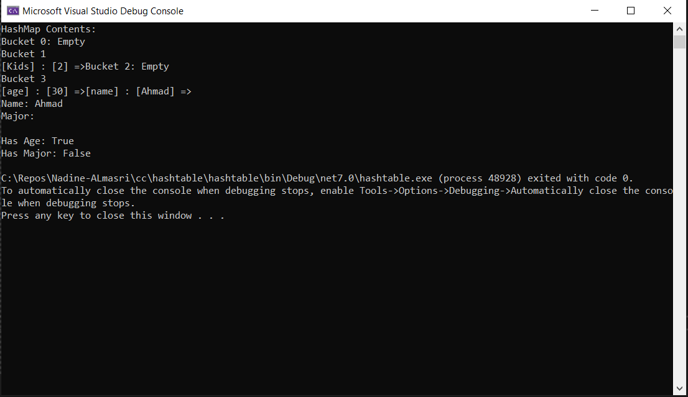
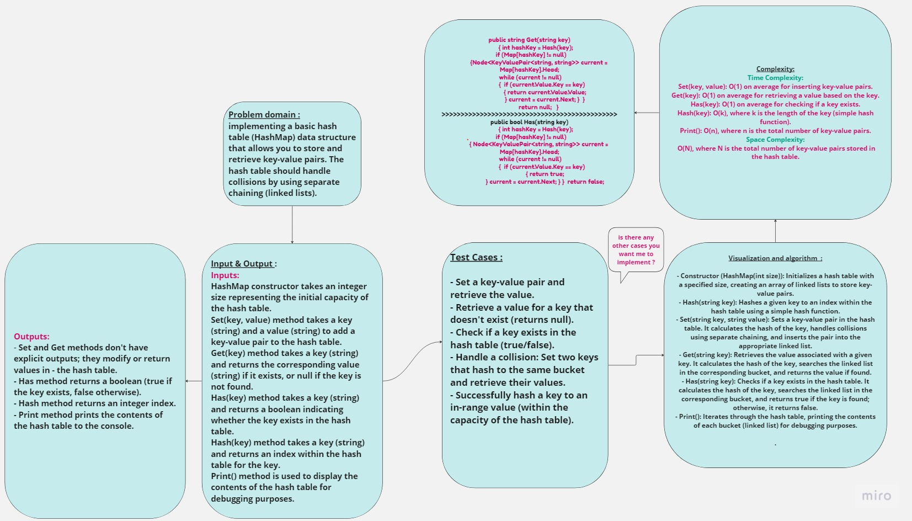

## Summary:
This code implementing a basic hash table (HashMap) data structure that allows you to store and retrieve key-value pairs. The hash table should handle collisions by using separate chaining (linked lists). The FindMax method is used to find the maximum value stored in the binary tree. It works for both Binary Search Trees (BST) and regular binary trees with numeric values.
## Description:
### Inputs:

- HashMap constructor takes an integer size representing the initial capacity of the hash table.
- Set(key, value) method takes a key (string) and a value (string) to add a key-value pair to the hash table.
- Get(key) method takes a key (string) and returns the corresponding value (string) if it exists, or null if the key is not found.
- Has(key) method takes a key (string) and returns a boolean indicating whether the key exists in the hash table.
- Hash(key) method takes a key (string) and returns an index within the hash table for the key.
- Print() method is used to display the contents of the hash table for debugging purposes.
### Outputs:

- Set and Get methods don't have explicit outputs; they modify or return values in the hash table.
- Has method returns a boolean (true if the key exists, false otherwise).
- Hash method returns an integer index.
- Print method prints the contents of the hash table to the console.
## Visual:
Here's a visual representation of the TreeMax :

## Approach & Efficiency:
 ### Time Complexity:

- Set(key, value): O(1) on average for inserting key-value pairs.
- Get(key): O(1) on average for retrieving a value based on the key.
- Has(key): O(1) on average for checking if a key exists.
- Hash(key): O(k), where k is the length of the key (simple hash function).
- Print(): O(n), where n is the total number of key-value pairs.
### Space Complexity: 
O(N), where N is the total number of key-value pairs stored in the hash table.

