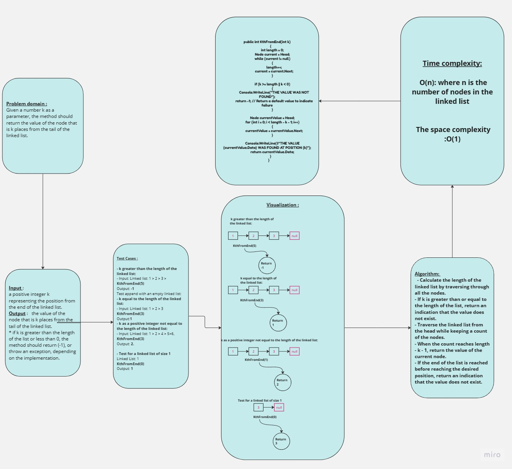
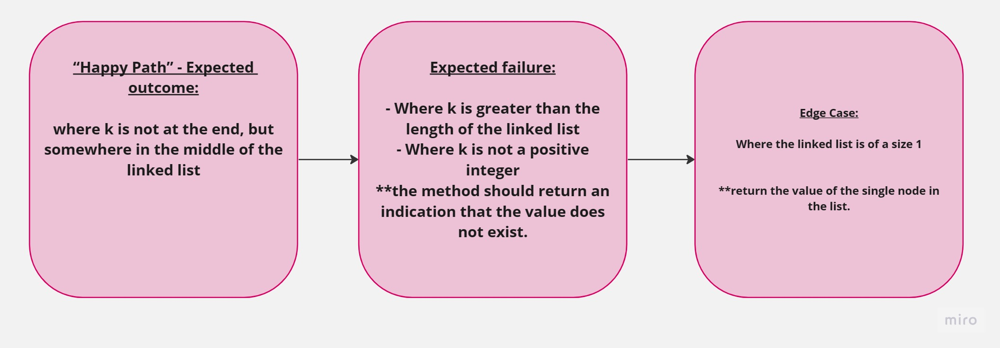

## Summary:
The code implements a linked list  with new method. 
It includes the kthFromEnd method, which returns the value of the node
that is k places from the tail of the linked list. The implementation follows the singly linked list concept,
where each node contains a value and a pointer to the next node.

## Description:
 The class includes the following methods:
- Insert :Insertion of nodes at the head of the list
- Append : adds a new node with the given value to the end of the list

- ADD before :adds a new node with the given new value immediately before the first node that has the value specified

- AddAfter :adds a new node with the given new value immediately after the first node that has the value specified
- Includes: Checks if a value exists as a node's value somewhere within the list and returns a Boolean.
- ToString: Returns a string representation of all the values in the linked list, formatted as "{ a } -> { b } -> { c } -> NULL".
- KthFromEnd: Returns the value of the node that is k places from the tail of the linked list .
## Approach & Efficiency:

- The Insert method inserts a new node at the head of the linked list, which has a constant time complexity of O(1).
- The Includes method iterates through the linked list to check if a value exists, which has a time complexity of O(n), where n is the number of nodes in the list.
- The ToString method iterates through the linked list to build a string representation of the values, which also has a time complexity of O(n).
- The KthFromEnd method calculates the length of the linked list in the first loop, which has a time complexity of O(n). Then, it traverses the list again to find the kth node from the end, resulting in a total time complexity of O(n).
*The space complexity of the linked list implementation is O(n), where n is the number of nodes in the list, as each node requires memory allocation.*
## Solution:
The code provided implements a basic linked list with the required methods. It should be functional for inserting nodes, checking if a value exists, converting the list to a string, and finding the kth node from the end.
## WhiteBoard 

