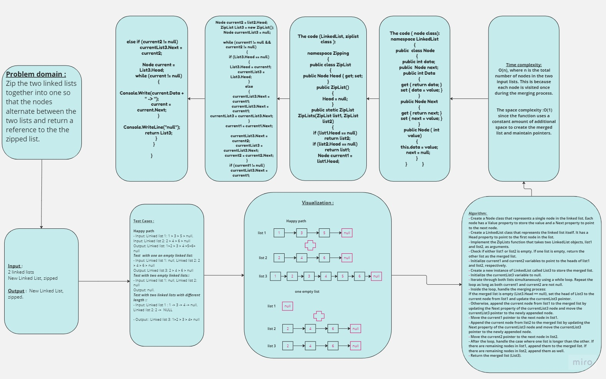
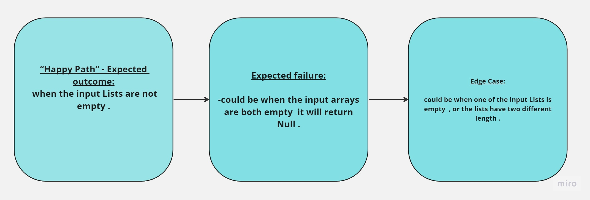

## Summary:
------------
The ZipLists function takes two linked lists as input and merges them into a new linked list, 
where the nodes alternate between the two lists. The merged list is returned as the result.
The implementation aims to minimize additional space usage, keeping it to O(1).
## Description:

The ZipLists function iterates through both input lists simultaneously,
merging their nodes alternately into a new linked list 3. 
It creates a new instance of the LinkedList class to store the merged list and maintains a pointer currentList3 to
keep track of the current node being appended to the merged list.
## Approach & Efficiency:
- The function starts by checking if either of the input lists is empty. If one list is empty, the other list is returned as the merged list, resulting in O(1) time complexity.
- The function then iterates through both lists simultaneously, merging their nodes alternately. It appends each node from list1 to the merged list, updates the pointers accordingly, and moves to the next nodes. This process continues until reaching the end of either list.
- After reaching the end of one list, the function handles the case where the other list is longer. It appends the remaining nodes from that list to the merged list.
- The function returns the merged list.
The time complexity of the function is O(n), where n is the total number of nodes in the two input lists. This is because each node is visited once during the merging process.
The space complexity is O(1) since the function uses a constant amount of additional space to create the merged list and maintain pointers.
## Solution:
The code Zip the two linked lists together into one so that the nodes alternate between the two lists and return a reference to the the zipped list.
## WhiteBoard   

