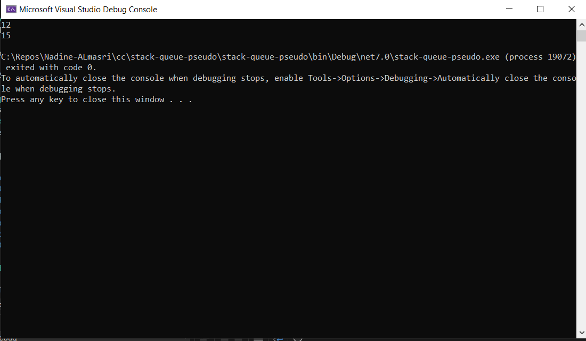
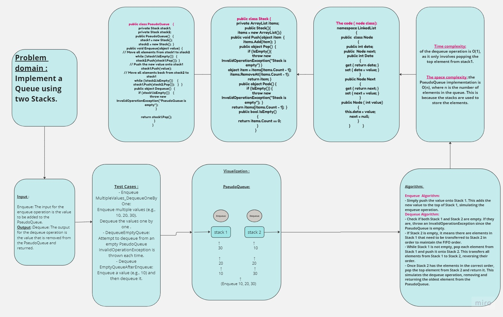

## Summary:

The C# PseudoQueue code implements a queue data structure using two stacks. The PseudoQueue class provides methods for enqueueing (adding) values and dequeuing (removing) values, following a first-in, first-out (FIFO) approach. It utilizes the Stack class, which is also implemented in the code, to manage the underlying data structure.

## Description:
The PseudoQueue class uses two instances of the Stack class, stack1 and stack2, to simulate a queue. When enqueueing a value, the code first transfers all elements from stack1 to stack2. Then it adds the new value to stack1. Finally, it transfers all elements back from stack2 to stack1, ensuring the FIFO order.

For dequeueing a value, the code simply pops the top element from stack1, which corresponds to the oldest value in the queue.

The Stack class provides methods for pushing (adding) elements to the stack, popping (removing) elements from the stack, peeking (retrieving the top element without removing it), and checking if the stack is empty.

## Approach & Efficiency:
The approach used in the PseudoQueue code is to simulate a queue using two stacks. The enqueue operation involves transferring elements between the two stacks to maintain the first-in, first-out (FIFO) order. The dequeue operation simply pops the top element from stack1, which corresponds to the oldest value in the queue.
## Using:
To use the PseudoQueue in your code, you can create an instance of the PseudoQueue class and call the Enqueue and Dequeue methods as needed.

Example usage:

	  PseudoQueue queue = new PseudoQueue();
            queue.Enqueue(12);
            queue.Enqueue(15);
            queue.Enqueue(18);
            Console.WriteLine(queue.Dequeue());  
            Console.WriteLine(queue.Dequeue());
This code creates a PseudoQueue object, enqueues two values (12 and 15 and 18), dequeues the oldest value (12),and then dequeues the next oldest value (15) and prints them to the console.

*The Console Output*

### Enqueue Operation:

- All elements from stack1 are transferred to stack2.
- The new value is pushed onto stack1.
- All elements are transferred back from stack2 to stack1.
- The time complexity of the enqueue operation is O(n), where n is the number of elements in the queue. This is because in the worst case scenario, when transferring elements, we need to iterate over all elements twice.

### Dequeue Operation:

- The top element from stack1 is popped and returned.
- The time complexity of the dequeue operation is O(1), as it only involves popping the top element from stack1.

- The space complexity of the PseudoQueue implementation is O(n), where n is the number of elements in the queue. This is because the stacks are used to store the elements.
## Solution:
you can create an instance of the PseudoQueue class with the desired type and use the Enqueue, Dequeue, and IsEmpty methods accordingly.
## WhiteBoard   

