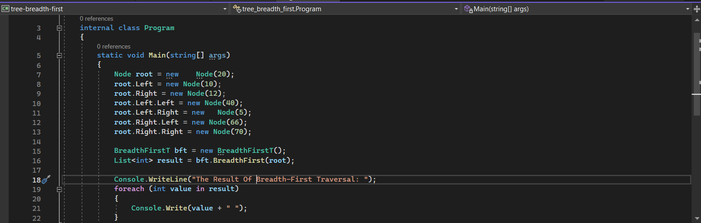
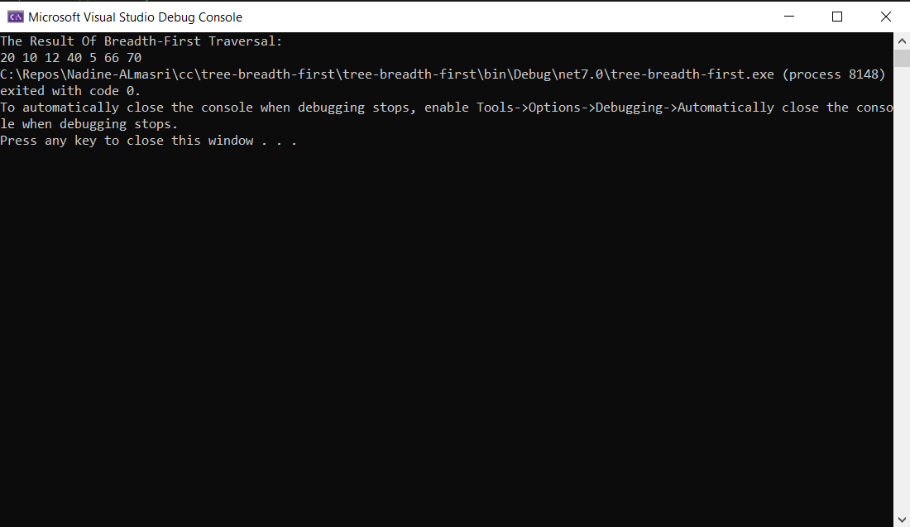
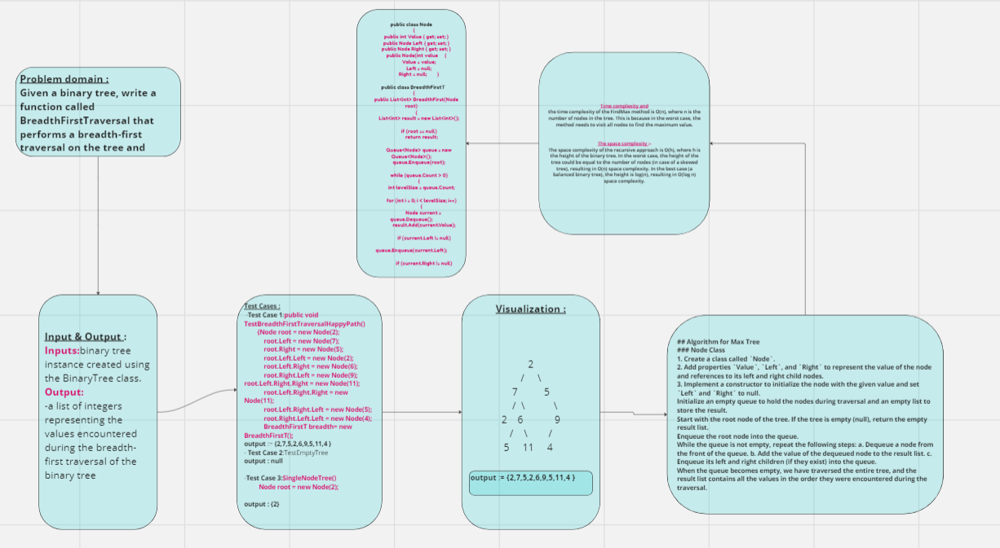

## Summary:
The challenge is to implement a breadth-first traversal algorithm for a binary tree. The goal is to traverse the tree level by level and return a list of all the values encountered during the traversal in the order they were encountered.

## Description:
A binary tree is a data structure where each node has at most two children, usually referred to as "left" and "right" children. In a breadth-first traversal, we visit all the nodes on the same level before moving to the next level. We use a queue to keep track of the nodes to visit.## Visual:

## Visual
Here's a visual representation of the TreeMax :

## Approach & Efficiency:
The time complexity of this breadth-first traversal algorithm is O(n), where n is the number of nodes in the binary tree. This is because we visit each node once
The space complexity is also O(n) because, in the worst case, the queue can hold all the nodes in the last level of the binary tree.

