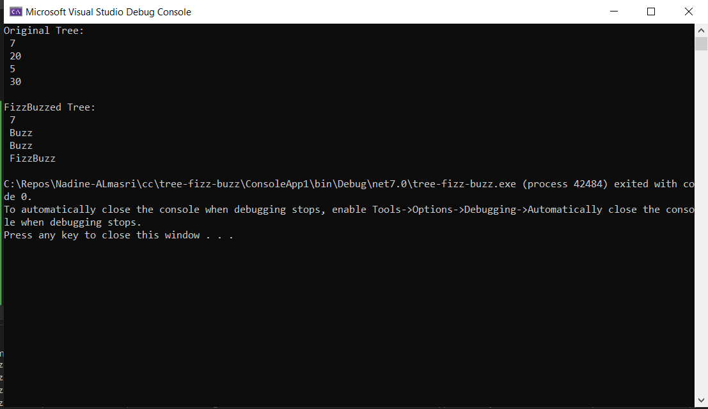
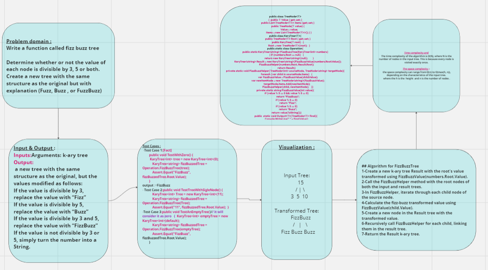

## Summary:
The code implements a transformation of a k-ary tree's node values using the "FizzBuzz" rules. It takes an input k-ary tree where each node holds an integer value, and returns a new k-ary tree with node values transformed according to certain rules. If a value is divisible by 3, it's replaced with "Fizz". If it's divisible by 5, it's replaced with "Buzz". If it's divisible by both 3 and 5, it's replaced with "FizzBuzz". If not divisible by either, the value is turned into a string.

## Description:
The code defines a C# class Operation containing static methods for transforming k-ary trees according to the FizzBuzz rules. The main method, FizzBuzzTree, takes an input k-ary tree of integers and returns a new k-ary tree of strings with transformed values.

The transformation process involves iterating through the input tree, checking each node's value, and applying the FizzBuzz rules to generate the corresponding string value. The transformed values are then used to construct a new k-ary tree mirroring the structure of the input tree.

## Visual
Here's a visual representation of the tree-fizz-buzz :

## Approach & Efficiency:
- The FizzBuzzTree method takes a k-ary tree of integers as input.
- If the input tree's root is null, the method returns a new k-ary tree with a null root.
Otherwise, it creates a new k-ary tree with the root value transformed using the FizzBuzzValue function.
- The FizzBuzzHelper method recursively traverses the input tree, transforming node values and constructing the transformed tree.
Each node's value is checked for divisibility by 3, 5, and both.
- The transformation follows the FizzBuzz rules and constructs the new tree.
- The transformed tree is returned as the result.
- The time complexity of the algorithm is O(N), where N is the number of nodes in the input tree. This is because every node is visited exactly once.

