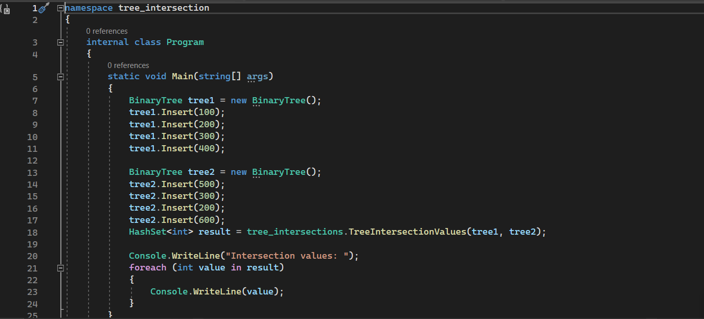
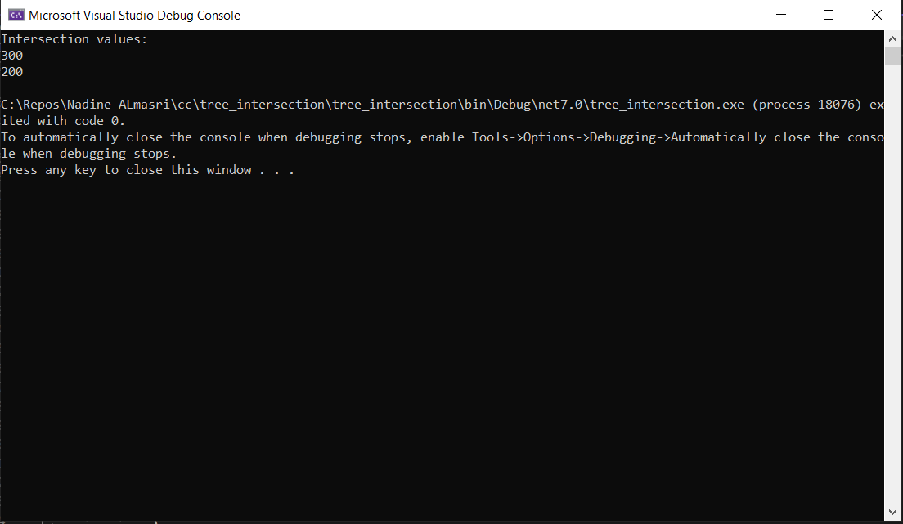
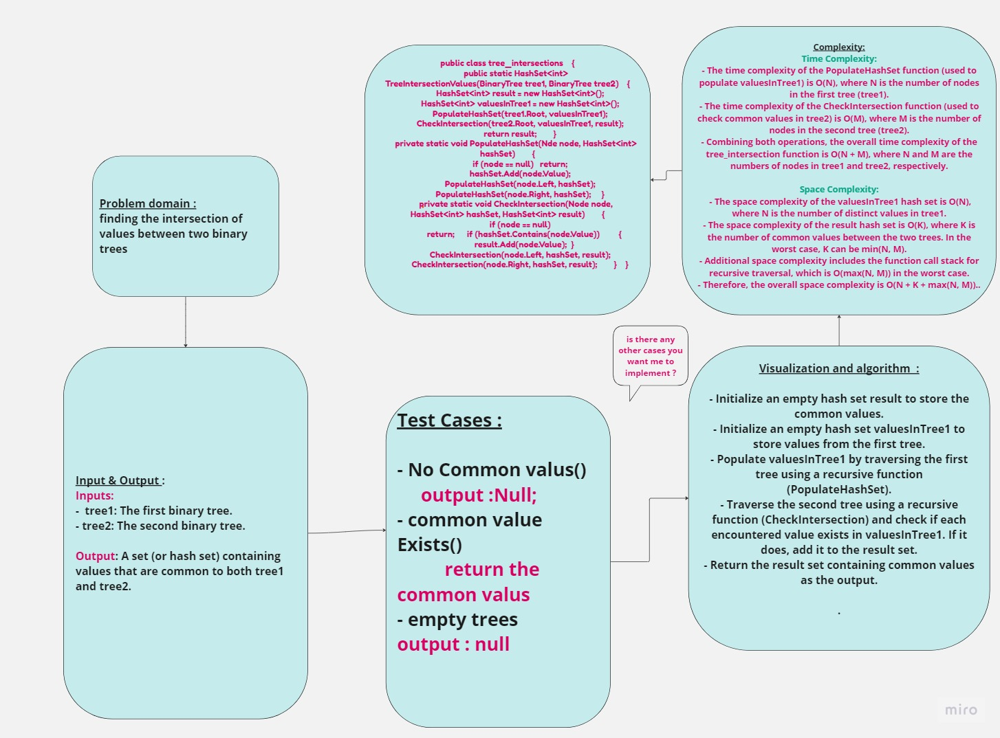

## Summary:
The tree_intersection function takes two binary trees as input and returns a set of values that are found in both trees. It uses a hash map (dictionary) to efficiently track the values encountered in the first tree and then compares those values with the second tree to find the intersection.
## Description:
Binary trees are hierarchical data structures where each node has at most two child nodes: a left child and a right child. The tree_intersection function aims to find values that exist in both of these binary trees.
### Inputs:

- tree1: The first binary tree.
- tree2: The second binary tree.
-### Outputs:
- A set (or hash set) containing values that are common to both tree1 and tree2.
## Visual:
Here's a visual representation of the code:

## Approach & Efficiency:
 ### Time Complexity:

- The time complexity of the PopulateHashSet function (used to populate valuesInTree1) is O(N), where N is the number of nodes in the first tree (tree1).
- The time complexity of the CheckIntersection function (used to check common values in tree2) is O(M), where M is the number of nodes in the second tree (tree2).
- Combining both operations, the overall time complexity of the tree_intersection function is O(N + M), where N and M are the numbers of nodes in tree1 and tree2, respectively.
### Space Complexity: 
- The space complexity of the valuesInTree1 hash set is O(N), where N is the number of distinct values in tree1.
- The space complexity of the result hash set is O(K), where K is the number of common values between the two trees. In the worst case, K can be min(N, M).
- Additional space complexity includes the function call stack for recursive traversal, which is O(max(N, M)) in the worst case.
- Therefore, the overall space complexity is O(N + K + max(N, M)).

